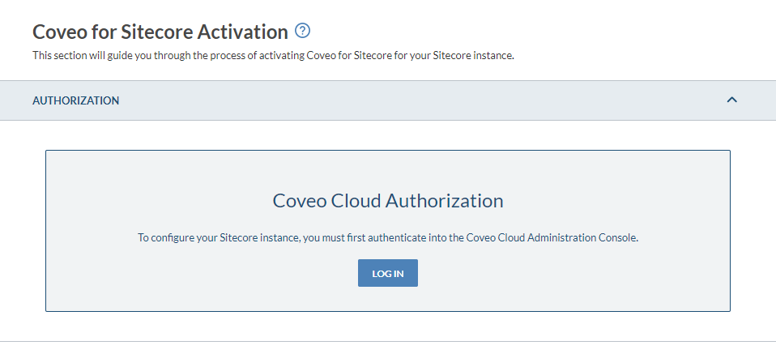
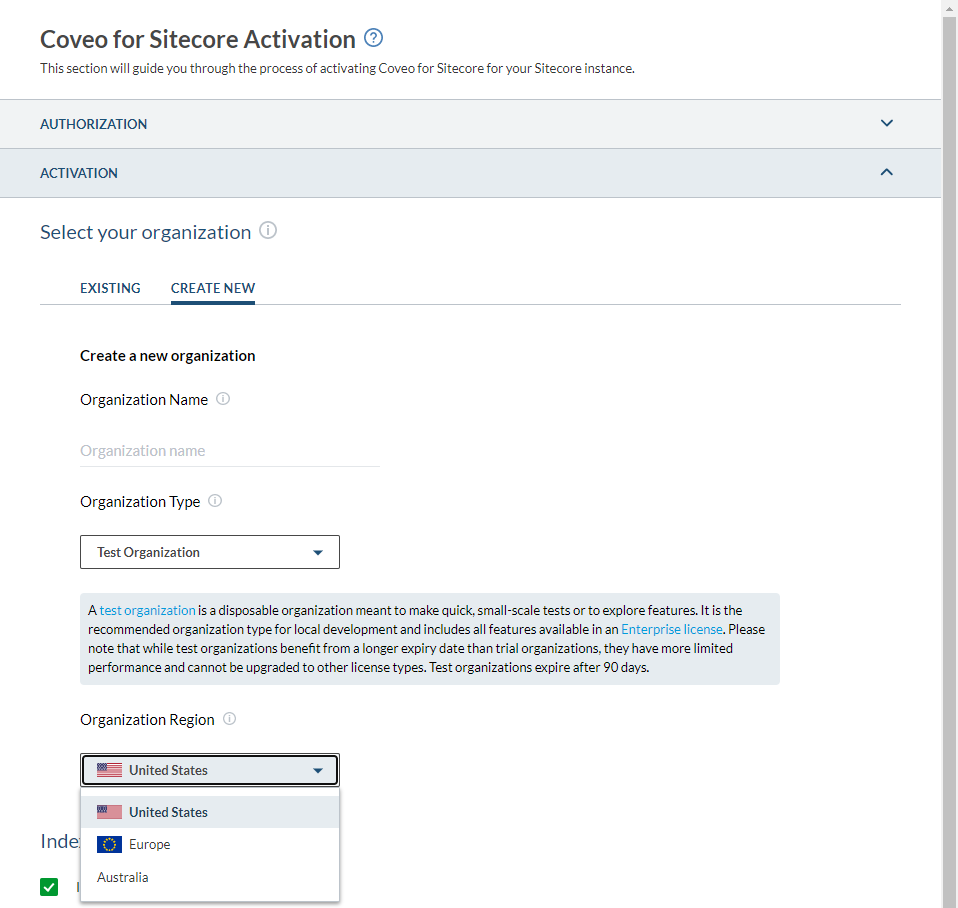
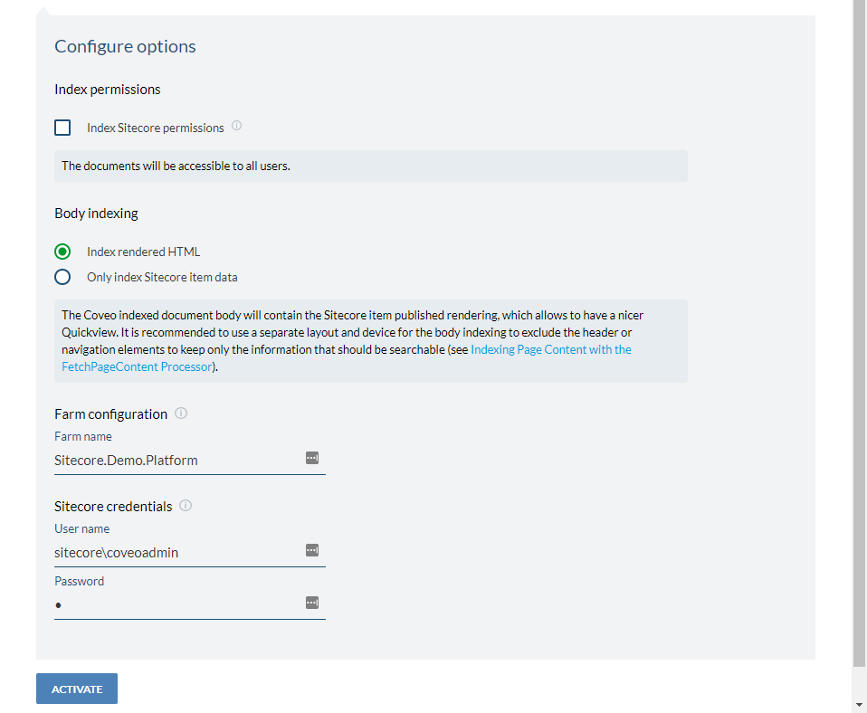
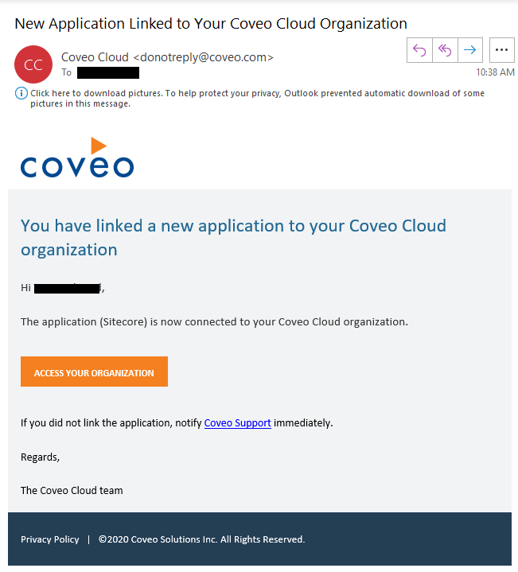
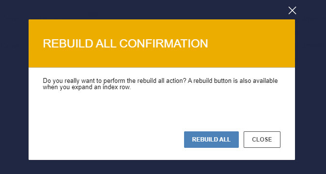
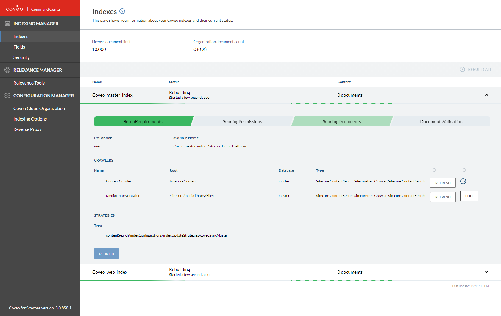
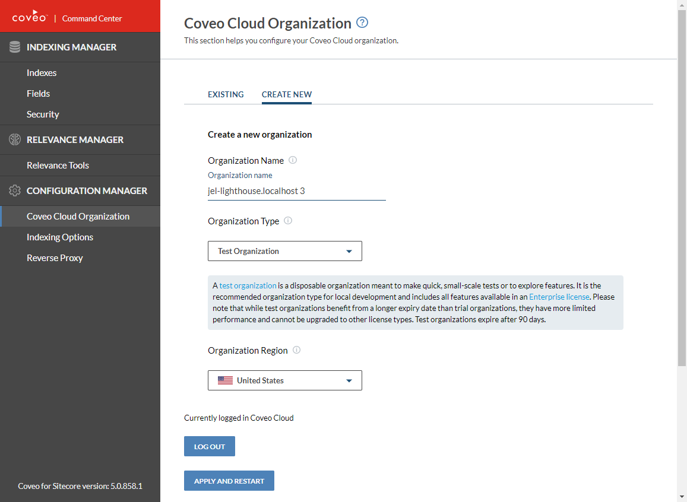
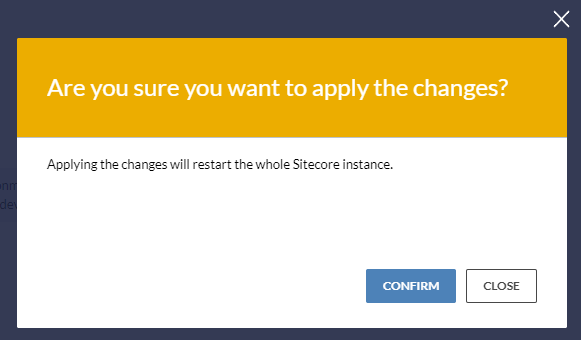

# Setup Coveo for Sitecore

## Prerequisites

* A working Sitecore instance.

## Configuring and Activating Coveo

1. Go to Launchpad > Control Panel

2. The first block on the left is about Coveo Search, where you can setup and maintain Coveo connections and configuration. Click on "Configuration Manager".

   

   * Your browser might be blocking the new tab popup. Approve popups from this domain and re-click the link.

3. On your first visit to the Coveo Command Center, Coveo for Sitecore will ask you to configure and activate Coveo for Sitecore. Under the "AUTHORIZATION" section, click the "LOG IN" button.

   

4. You will be asked to login to Coveo Cloud. Choose the appropriate email provider (Google, Office365 or Salesforce).

   

5. This will take you to a page that will ask to authorize your Sitecore instance to access all of your Coveo Cloud organizations. Click on the orange "Authorize" button.

   

6. Once logged in, you will be redirected back to the Coveo for Sitecore activation page. Under the "Select your organization" section, select the the "CREATE NEW" tab.

7. Fill the form with the following information:
   * Organization Name: Choose a distinctive name for your demo needs.
   * Organization Type: Test Organization. (This is valid for 90 days from the day you are creating it.)
   * Organization Region: United States. (For the moment this is the only region that would work sue to a demo architecture decision. We are working to enable all regions soon.)

   

8. Under the "Index Sitecore Content" section, ensure the "Index Sitecore content" checkbox is checked.

   

9. Under the "Configure options" section, use the following values:
   * Index permissions: Uncheck the box.
   * Body indexing: Index rendered HTML.
   * Farm name: Sitecore.Demo.Platform (or something relevant to the environment you are setting up)
   * User name: sitecore\coveoadmin
   * Password: The `SITECORE_ADMIN_PASSWORD` environment variable value that is set in your `.env` file.

   

10. Click the "ACTIVATE" button.
    * You will be redirected to the Indexes page.
    * Please be patient as it could take up to 5 minutes to show the indexes on this page.
    * If you see "An error has occurred" on the Indexes page, refresh the page.

      

    * You should see two indexes on the Indexes page.
      * Coveo_master_index
      * Coveo_web_index

        

11. Before rebuilding the indexes, open a new browser tab and navigate to `http://<YOUR-CM-HOSTNAME>/Utilities/PostCmCoveoActivation.aspx`
    * This page will:
      * Send and write the Coveo CM configuration to the CD.
      * Activate Coveo on the CD.
      * Activate the demo configuration files on both the CD and CM.
    * When it is done, the page should display "SUCCESS: Coveo configured and activated on both the CD and CM.". You can close the tab.

12. Back in the Coveo Command Center Indexes page, refresh the page.

13. [Rebuild the Coveo indexes](#how-to-rebuild-coveo-indexes).

14. Enjoy Coveo!

## Accessing your Coveo Cloud Organization

Once everything is setup you will see an email in your inbox. You can click the "ACCESS YOUR ORGANIZATION" button from the email to access the Coveo Cloud Platform.

## How to Rebuild Coveo Indexes

During the init container jobs, the 2 Coveo indexes are automatically rebuilt if Coveo is configured to be automatically activated at the startup of the containers.

Coveo for Sitecore automatically process new items, modified items, and deleted items in the master database and indexes those synchronously. It also asynchronously indexes all items that have been modified after a publish opperation.

From time to time however, you might need to rebuild the Coveo indexes.

1. Go to Launchpad > Control Panel

2. The first block on the left is about Coveo Search, where you can setup and maintain Coveo connections and configuration. Click on "Indexing Manager".

   

   * Your browser might be blocking the new tab popup. Approve popups from this domain and re-click the link.
   * You should see two indexes on the Indexes page.
     * Coveo_master_index
     * Coveo_web_index

       

3. Above the indexes table, click the "REBUILD ALL" button.

   

4. Inside the confirmation dialog, click the "REBUILD ALL" button. The rebuild will start.

5. Wait for the rebuild operation to be completed.

   

6. Due to an issue running Coveo for Sitecore on Docker, we had to disable post-rebuild validations. You must manually validate that the indexed documents are searchable by [accessing your Coveo Cloud organization](#accessing-your-coveo-cloud-organization).
   1. In the left navigation, click the "Content > Content Browser" section.
   2. Until you see that all the documents "Indexed date" is the date and time of your rebuild, click the "magnifier" search button every minute.

7. You can now use the search page and get the new results back.

## What to do When Your Coveo Cloud Organization is About to Expire

When your current Coveo Cloud organization is about to expire, you have two choices:

1. Ask a Coveo representative to extend your Coveo Cloud organization expiration date.
2. Create a new Coveo Cloud organization.

### Create a new Coveo Cloud Organization

1. Go to Launchpad > Control Panel

2. The first block on the left is about Coveo Search, where you can setup and maintain Coveo connections and configuration. Click on "Configuration Manager".

   

   * Your browser might be blocking the new tab popup. Approve popups from this domain and re-click the link.

3. On the "Coveo Cloud Organization" page, under the "Current organization" section, click on the "LOG IN" button.

   

4. You will be asked to login to Coveo Cloud. Choose the appropriate email provider (Google, Office365 or Salesforce).

   

5. This will take you to a page that will ask to authorize your Sitecore instance to access all of your Coveo Cloud organizations. Click on the orange "Authorize" button.

   

6. Once logged in, you will be redirected back to the "Coveo Cloud Organization" page. Select the the "CREATE NEW" tab.

7. Fill the "Create a new organization" form with the following information:
   * Organization Name: Choose a new distinctive name for your demo needs.
   * Organization Type: Test Organization. (This is valid for 90 days from the day you are creating it.)
   * Organization Region: United States. (For the moment this is the only region that would work sue to a demo architecture decision. We are working to enable all regions soon.)

   

8. Click the "APPLY AND RESTART" button.

   

9. A confirmation dialog will appear. Click the "CONFIRM" button.
   * You will be redirected to the Indexes page when Sitecore has restarted due to the configuration change.
   * Please be patient as it could take up to 5 minutes to show the indexes on this page.
   * If you see "An error has occurred" on the Indexes page, refresh the page.

     

   * You should see two indexes on the Indexes page.
     * Coveo_master_index
     * Coveo_web_index

       

10. Before rebuilding the indexes, open a new browser tab and navigate to `http://<YOUR-CM-HOSTNAME>/Utilities/PostCmCoveoActivation.aspx`
    * This page will:
      * Send and write the new Coveo CM configuration to the CD.
    * When it is done, the page should display "SUCCESS: Coveo configured and activated on both the CD and CM.". You can close the tab.

11. Back in the Coveo Command Center Indexes page, refresh the page.

12. [Rebuild the Coveo indexes](#how-to-rebuild-coveo-indexes).

13. Enjoy Coveo!
